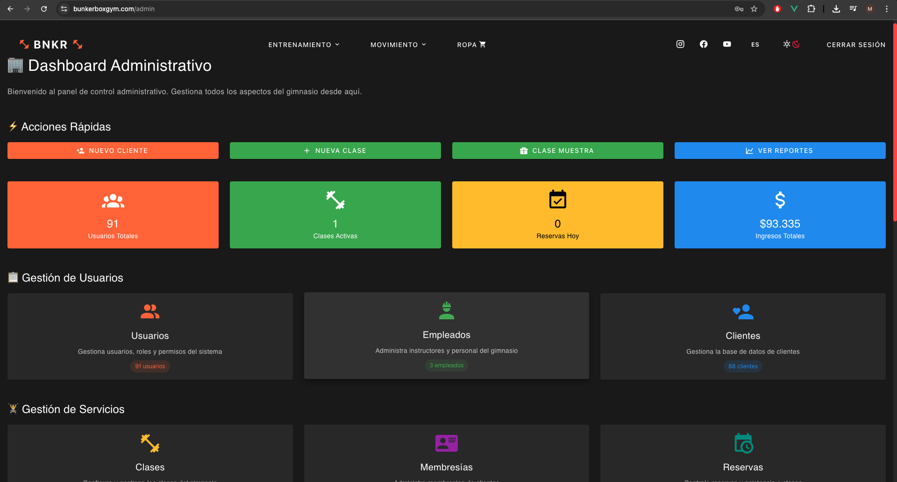
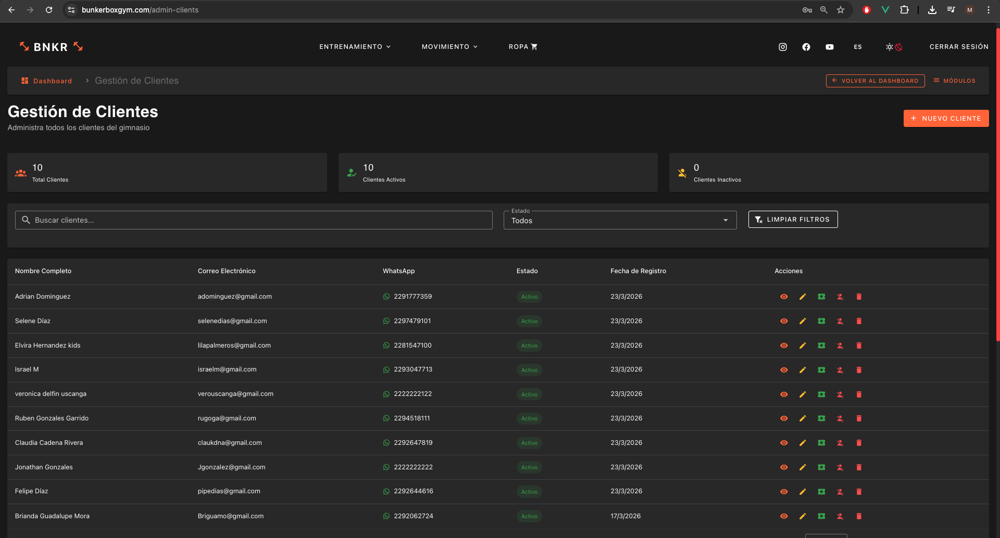
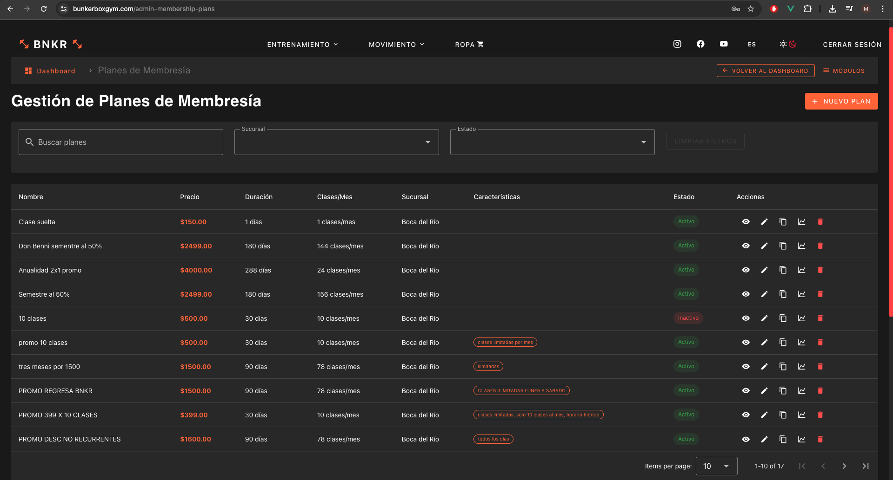
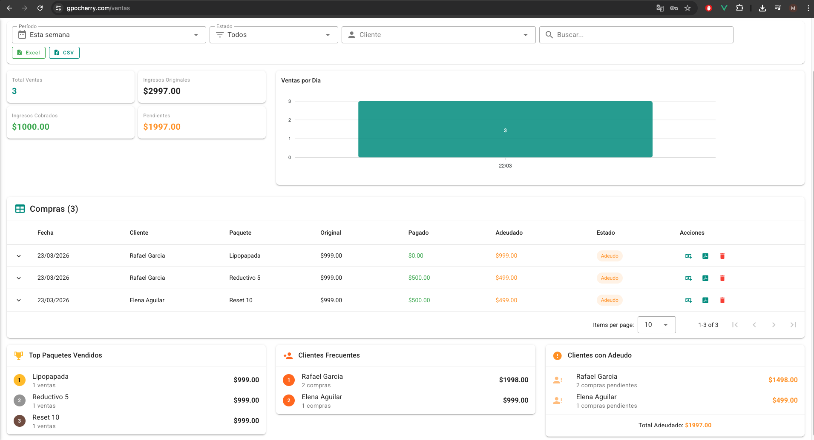
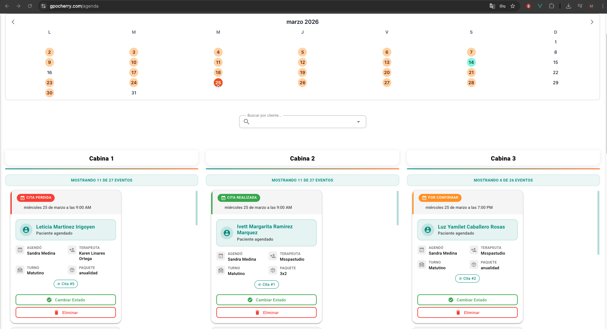
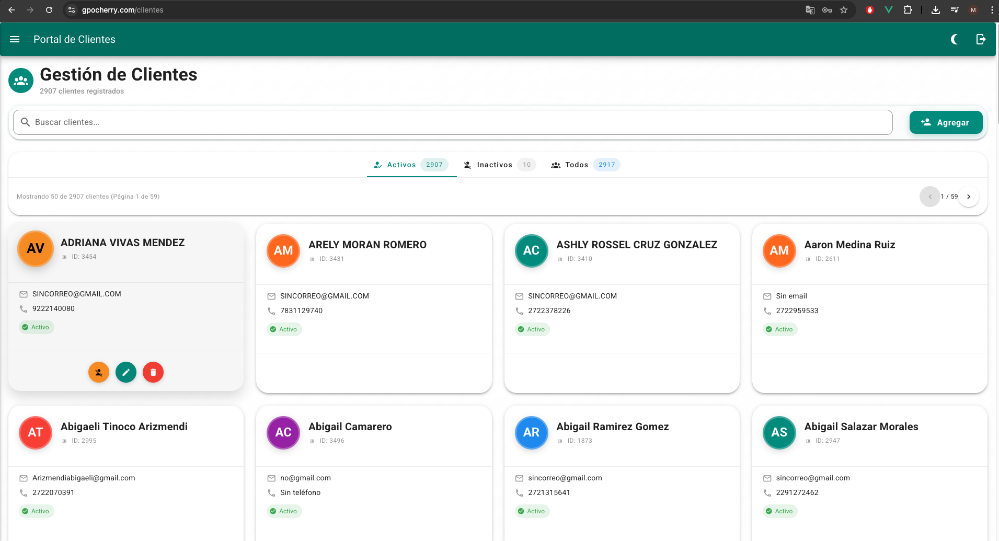

# ¡Hola! Soy Misael Rosas Carballo 👋


<div align="center">
<a href="https://git.io/typing-svg"></a>
</div>

---

## Sobre mí

```typescript
const edcko: Developer = {
  name: "Misael Rosas Carballo",
  location: "México 🇲🇽",
  languages: ["Español", "English"],

  currentlyBuilding: [
    "🛠️ Techne — Open source AI coding ecosystem in Go",
    "📱 Client Reminder Pro — React Native / Expo",
    "🏛️ Public Security — Next.js + PostgreSQL + DDD"
  ],

  productionSystems: {
    BNKR: {
      type: "Sistema de gestión para gimnasios",
      stack: ["Vue.js", "Node.js", "PostgreSQL", "Stripe"],
      status: "🟢 En producción"
    },
    Cherry: {
      type: "Sistema de gestión para spas",
      stack: ["Vue 3", "Socket.io", "multi-tenant"],
      status: "🟢 En producción"
    }
  },

  dailyTools: ["Neovim", "Tmux", "Git", "Docker"],

  philosophy: "Cada capa del sistema importa — desde la UI hasta la infraestructura"
};
```

---

<details>
<summary><b>📊 Estadísticas de GitHub</b></summary>
<br>

<picture>
  <source media="(prefers-color-scheme: dark)" srcset="https://github-readme-stats.vercel.app/api/top-langs/?username=Edcko&layout=donut-vertical&theme=tokyonight&hide_border=true&bg_color=0D1117&langs_count=8" />
  <source media="(prefers-color-scheme: light), (prefers-color-scheme: no-preference)" srcset="https://github-readme-stats.vercel.app/api/top-langs/?username=Edcko&layout=donut-vertical&hide_border=true&langs_count=8" />
  
</picture>

<picture>
  <source media="(prefers-color-scheme: dark)" srcset="https://github-readme-stats.vercel.app/api?username=Edcko&show_icons=true&theme=tokyonight&hide_border=true&bg_color=0D1117&title_color=3B82F6&icon_color=3B82F6&hide_rank=true" />
  <source media="(prefers-color-scheme: light), (prefers-color-scheme: no-preference)" srcset="https://github-readme-stats.vercel.app/api?username=Edcko&show_icons=true&theme=default&hide_border=true&hide_rank=true" />
  
</picture>

</details>

---

## Proyectos destacados

### 🏋️ [Sistema de Gestión para Gimnasios — BNKR](https://www.bunkerboxgym.com)

Desarrollo integral de una plataforma para la administración operativa de gimnasios con múltiples sucursales, enfocada en membresías, reservas, control de usuarios y seguimiento del negocio.

<p align="center">
  
  
</p>

<p align="center">
  
</p>

**Principales funcionalidades:**
- Gestión multi-sucursal con separación operativa de información
- Integración de pagos con Stripe para membresías y renovaciones
- Reservas de clases con control de capacidad e instructores
- Sistema de roles y permisos para distintos tipos de usuario
- Dashboard con métricas, reportes y seguimiento operativo
- Módulo de inventario con alertas por niveles de stock

**Stack principal:** Vue.js 3 · Node.js · TypeScript · PostgreSQL · Prisma · Stripe · Socket.io · Docker · Nginx

---

### 💆 [Sistema de Gestión para Spas — Cherry](https://www.gpocherry.com/login)

Plataforma de gestión para spas orientada a la administración de sucursales, agenda operativa, clientes, servicios y seguimiento comercial.

<p align="center">
  
  
</p>

<p align="center">
  
</p>

**Principales funcionalidades:**
- Calendario operativo con validación de conflictos y control de cabinas
- Gestión de clientes con historial de sesiones, compras y pagos
- Arquitectura multi-tenant para operación de múltiples sucursales
- Sistema de roles con permisos diferenciados por perfil
- Reportes exportables para administración y control interno
- Sincronización en tiempo real para reflejar cambios entre usuarios

**Stack principal:** Vue 3 · Pinia · Vuetify · Node.js · Express · PostgreSQL · Socket.io · JWT

---

## Stack tecnológico

**Lenguajes**  


**Frontend**  


**Backend e infraestructura**  


---

## Contacto

[](mailto:misaelrosascarballo@gmail.com)
[](https://www.linkedin.com/in/misael-rosas-carballo)

---


